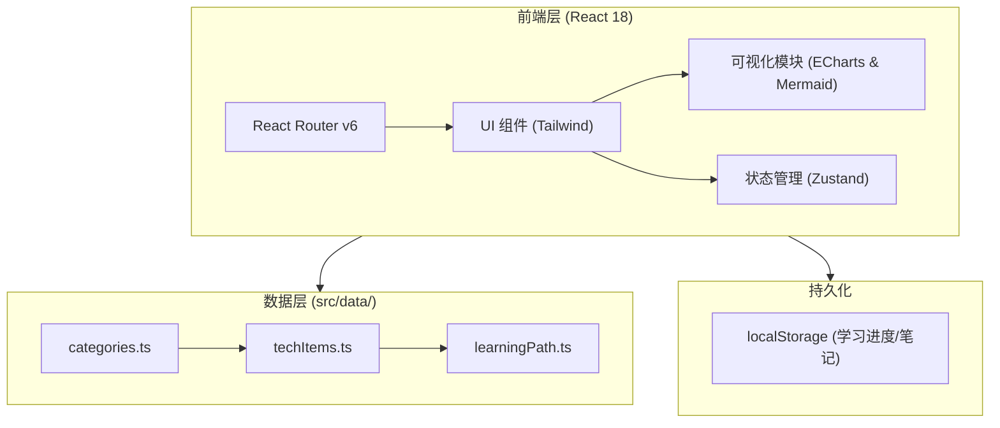
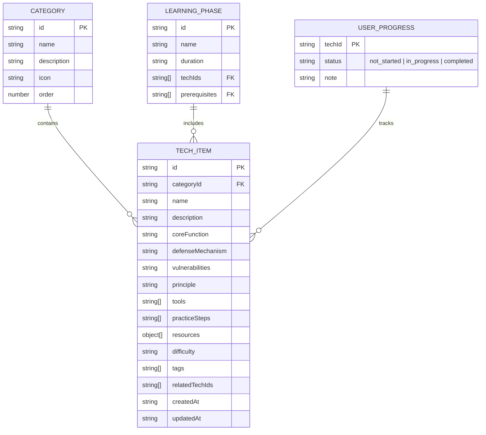

## 1. 架构设计



## 2. 技术栈说明
- **前端框架**：React@18 + TypeScript + Vite
- **样式方案**：Tailwind CSS@3 (定制深色主题: `#0D1117`, `#161B22`, `#00E5FF`)
- **路由管理**：React Router v6
- **状态管理**：Zustand（用于全局学习进度、主题等轻量级管理）
- **可视化图表**：ECharts (用于科技树) + Mermaid/React Flow (用于学习路径)
- **图标库**：lucide-react
- **Markdown 渲染**：react-markdown (支持 Frontmatter 与代码高亮)
- **打包导出**：jszip (用于导出 Markdown 压缩包)

## 3. 路由定义

| 路由 | 页面名称 | 目的描述 |
|-------|---------|---------|
| `/` | 首页 | 展示四大分类、攻防模拟器及导出按钮 |
| `/:categoryId` | 分类详情页 | 展示该分类下技术点的列表及详细 Markdown |
| `/tech-tree` | 科技树 | 渲染全局 `categories` 与 `techItems` 的层级关系树 |
| `/roadmap` | 学习路径 | 渲染 `learningPath` 进阶路线图 |
| `/my-learning` | 我的学习 | 管理用户在各技术点的完成度与文本笔记 |

## 4. API 定义
本项目当前为纯前端架构，预留 `/api/knowledge` 接口设计。

```typescript
// GET /api/knowledge - 导出知识库接口定义
interface KnowledgeResponse {
  categories: Category[];
  techItems: TechItem[];
  learningPath: LearningPhase[];
  userProgress?: UserProgress;
}
```

## 5. 核心逻辑设计
### 5.1 数据驱动渲染
- 所有的组件（导航、卡片、表格、树图）均不硬编码数据，直接读取 `src/data/` 目录。
- 添加新的 `techItem` 仅需修改 `techItems.ts` 文件。
- 导出功能读取全局静态数据及 `Zustand/localStorage` 中的状态进行组装。

### 5.2 导出逻辑
- **JSON 导出**：将整个 `KnowledgeResponse` JSON.stringify 后利用 Blob 触发下载。
- **Markdown 导出**：循环遍历 `techItems`，结合对应 `Category` 信息，拼装 Markdown Frontmatter 及正文内容。利用 `jszip` 将生成的所有 `.md` 文件打包为 ZIP 提供下载。

## 6. 数据模型
### 6.1 数据模型定义



### 6.2 初始化数据结构设计
位于 `src/data/*.ts` 中：
```typescript
export interface Category { id: string; name: string; description: string; icon: string; order: number; }
export interface TechItem { id: string; name: string; categoryId: string; description: string; coreFunction: string; defenseMechanism: string; vulnerabilities: string; principle: string; tools: string[]; practiceSteps: string[]; resources: Array<{title: string; url: string}>; difficulty: 'low' | 'medium' | 'high'; tags: string[]; relatedTechIds: string[]; createdAt: string; updatedAt: string; }
export interface LearningPhase { id: string; name: string; duration: string; techIds: string[]; prerequisites: string[]; }
export interface UserProgress { [techId: string]: { status: 'not_started' | 'in_progress' | 'completed'; note: string; } }
```