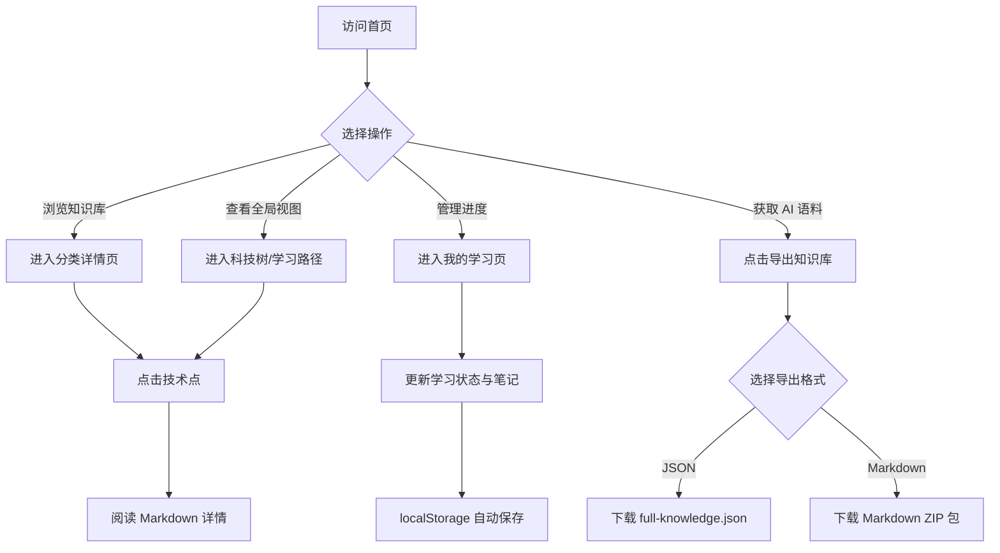

## 1. 产品概述
本项目是一个基于 Web 的“网络安全防御技术可视化学习知识库（AI-Ready 可扩展版）”。
- 主要目的在于提供一个高颜值的可视化学习平台，帮助用户结构化地学习网络安全防御技术，同时其数据层设计为高度结构化的 JSON Schema。
- 它不仅面向人类用户浏览、学习和记录进度，更支持一键导出结构化的 JSON 和 Markdown，便于无缝喂给诸如 OpenClaw 等 AI Agent 框架，实现“人类学习 + AI 语料”的双重价值。

## 2. 核心功能

### 2.1 用户角色
| 角色 | 注册方式 | 核心权限 |
|------|---------------------|------------------|
| 普通用户 | 无需注册（本地 localStorage 存储） | 浏览所有防御技术分类、管理学习进度、导出知识库 |

### 2.2 功能模块
1. **首页**：四大分类入口卡片、攻防模拟器模块、全局导出按钮。
2. **分类详情页**：防御技术点表格展示、多维度检索、技术点详情模态框（Markdown 渲染）。
3. **科技树页面**：基于 ECharts 的安全防御体系树状图展示。
4. **学习路径页面**：基于 Mermaid 或 React Flow 的进阶学习路线图。
5. **我的学习页面**：学习进度追踪、按分类分组的状态切换、纯文本笔记记录。

### 2.3 页面详情
| 页面名称 | 模块名称 | 功能描述 |
|-----------|-------------|---------------------|
| 首页 (/) | 分类导航与攻防模拟 | 渲染 `categories` 数据卡片，提供场景选择、推荐组合与防御覆盖率进度条，提供导出知识库按钮 |
| 分类详情页 (/:categoryId) | 技术点列表 | 表格形式展示该分类下的 `techItems`，支持搜索排序，点击技术名称弹窗展示 Markdown 详情 |
| 科技树 (/tech-tree) | 全局知识结构图 | 渲染以“网络安全防御体系”为根节点的动态 ECharts 树图，支持缩放、拖拽及导出图片 |
| 学习路径 (/roadmap) | 进阶路线图 | 使用 Mermaid 或 React Flow 渲染 `learningPath` 数据，节点悬浮展示描述，点击跳转 |
| 我的学习 (/my-learning) | 进度与笔记管理 | 基于 `localStorage` 和 `techItems` 计算总进度，支持修改单项学习状态及保存笔记文本，提供重置进度功能 |

## 3. 核心流程
用户在平台中的核心交互流程如下：浏览分类与科技树 -> 深入技术点学习 -> 记录学习进度与笔记 -> 将结构化知识库导出给 AI Agent 使用。

## 4. 用户界面设计

### 4.1 设计风格
- **主色调与背景**：深色主题，背景色 `#0D1117`，卡片及模块背景 `#161B22`。
- **强调色**：赛博朋克/科技感青色 `#00E5FF`，用于高亮、按钮、进度条及活跃节点。
- **字体与排版**：系统默认无衬线字体，注重层级关系，适当的负空间。
- **布局风格**：卡片式布局，侧边栏/顶部导航结合。
- **动画效果**：自然平滑的过渡，科技树节点展开、进度条填充、卡片悬浮均需具备微交互动画。

### 4.2 页面设计概览
| 页面名称 | 模块名称 | UI 元素描述 |
|-----------|-------------|-------------|
| 首页 | 头部与分类网格 | 强调色高亮的极客风格标题，卡片悬浮边框高亮 (`#00E5FF`) |
| 首页 | 攻防模拟器 | 场景下拉选择器，覆盖率渐变进度条 |
| 分类详情页 | 数据表格与模态框 | 深色斑马纹表格，模态框带毛玻璃背景 (Backdrop-filter) |
| 科技树 | ECharts 画布 | 根节点金色、分类蓝色、技术点绿色，连线平滑曲线 |
| 学习路径 | Mermaid 图表 | 强调阶段连贯性的深色主题定制流程图 |
| 我的学习 | 进度面板与笔记 | 进度圆环或条状图，极简文本域输入，状态切换 Toggle |

### 4.3 响应式设计
- **Desktop-first**：优先保证桌面端大屏下的可视化图表（ECharts/Mermaid）及表格的完美展示。
- **Mobile-adaptive**：移动端下分类卡片转为单列，表格支持横向滚动，科技树默认缩放适配屏幕。
