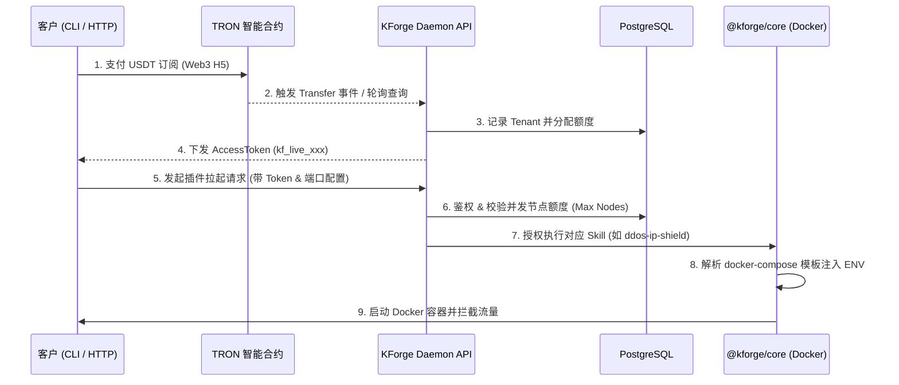

# KForge API 服务与插件调用部署指南

本指南面向 KForge 全球防御网络的开发者与高级会员，详细说明如何通过 API 服务和 CLI 工具完成从**身份认证**到**防御插件（盾牌）部署**的完整生命周期。

---

## 1. 系统交互架构 (Architecture Flow)

KForge 采用典型的 `Client -> Gateway -> Engine -> Container` 架构：



---

## 2. 核心 API 接口定义

KForge Daemon (`packages/daemon`) 提供了用于鉴权和插件调用的 RESTful API。

### 2.1 模拟/真实支付认证接口
- **URL**: `GET /api/payment/verify`
- **功能**: 根据客户钱包地址和付款金额，分配或续期会员身份，并下发 `AccessToken`。
- **请求参数**:
  - `wallet` (string, 必填): 客户波场钱包地址
  - `amount` (number, 必填): 支付的 USDT 金额 (影响会员 Tier: Pro/Enterprise)
- **响应示例**:
  ```json
  {
    "status": "success",
    "message": "Transaction confirmed. Subscription activated.",
    "data": {
      "accessToken": "kf_live_3x9v2k_1711234567",
      "tier": "Enterprise",
      "maxActiveNodes": 50
    }
  }
  ```

### 2.2 插件执行接口 (拉起防御盾牌)
- **URL**: `POST /api/skills/:skillId/execute`
- **功能**: 在宿主机拉起指定的防御插件 Docker 容器。
- **认证方式**: HTTP Header `Authorization: Bearer <AccessToken>`
- **URL 参数**:
  - `skillId`: 插件的唯一标识 (如 `ddos-ip-shield`, `waf-shield`, `deception-honeypot`)
- **请求体 (Body)**:
  ```json
  {
    "env": {
      "PUBLIC_PORT": "8080",
      "TARGET_HOST": "host.docker.internal",
      "TARGET_PORT": "3000"
    }
  }
  ```
- **响应示例**:
  ```json
  {
    "message": "Skill deployed successfully",
    "skillId": "waf-shield",
    "dbNodeId": "uuid-1234-5678"
  }
  ```
- **错误码**:
  - `401`: Token 缺失或无效
  - `403`: 订阅已过期
  - `429`: 达到会员并发节点额度上限 (Rate Limit Exceeded)

---

## 3. 客户端调用示例 (Deployment Examples)

除了使用官方的 `kforge-cli`，您也可以直接通过 HTTP 请求将 KForge 嵌入到您自己的运维脚本 (CI/CD、Ansible、Terraform) 中。

### 示例 1: 使用 KForge CLI 一键拉起 WAF
假设您有一个运行在 `localhost:3000` 的脆弱 Web 服务，您想在它的前端套一层抗注入的 WAF 盾牌（监听 `80` 端口）。

```bash
# 1. 全局安装 CLI (如果尚未安装)
npm install -g @kforge/cli

# 2. 执行保护命令
kforge protect \
  --token "kf_live_3x9v2k_1711234567" \
  --skill "waf-shield" \
  --port 80 \
  --target-host "host.docker.internal" \
  --target-port 3000
```
*执行后，访问 `http://localhost:80/?id=1' OR 1=1` 将被直接拦截返回 403。*

### 示例 2: 使用 cURL 脚本拉起高交互蜜罐
如果您想在多台服务器上批量部署蜜罐网络，可以使用纯 cURL 脚本调用 API：

```bash
#!/bin/bash
TOKEN="kf_live_3x9v2k_1711234567"
DAEMON_URL="http://your-daemon-server.com:4000"

curl -X POST "$DAEMON_URL/api/skills/deception-honeypot/execute" \
     -H "Authorization: Bearer $TOKEN" \
     -H "Content-Type: application/json" \
     -d '{
           "env": {
             "PUBLIC_PORT": "2222"
           }
         }'
```
*执行后，该服务器将暴露一个假的 2222 端口，诱导黑客进行 SSH 爆破。*

---

## 4. 插件 (Skill) 扩展规范

如果您是 KForge 平台开发者，想要向系统中添加新的防御护城河，只需遵循以下结构：

1. 在 `simulations/` 目录下新建您的插件文件夹，例如 `my-new-shield/`。
2. 必须包含一个 `docker-compose.yml`，其中的环境变量必须使用 `${VAR_NAME}` 占位符。
   ```yaml
   # simulations/my-new-shield/docker-compose.yml
   version: '3'
   services:
     shield:
       image: my-shield-image:latest
       ports:
         - "${PUBLIC_PORT}:80"
       environment:
         - UPSTREAM=${TARGET_HOST}:${TARGET_PORT}
   ```
3. (可选) 提供 `attack.sh` 和 `detect.sh` 脚本用于验证防御效果。
4. KForge `@kforge/core` 引擎会自动扫描该目录，并在收到 API 请求时，将传入的 `env` JSON 对象注入为环境变量并执行 `docker-compose up -d`。

---

> **安全提示**：请妥善保管您的 `AccessToken`，它代表了您的 Web3 资产和云端计算资源。切勿将其硬编码在公开的代码仓库中。
